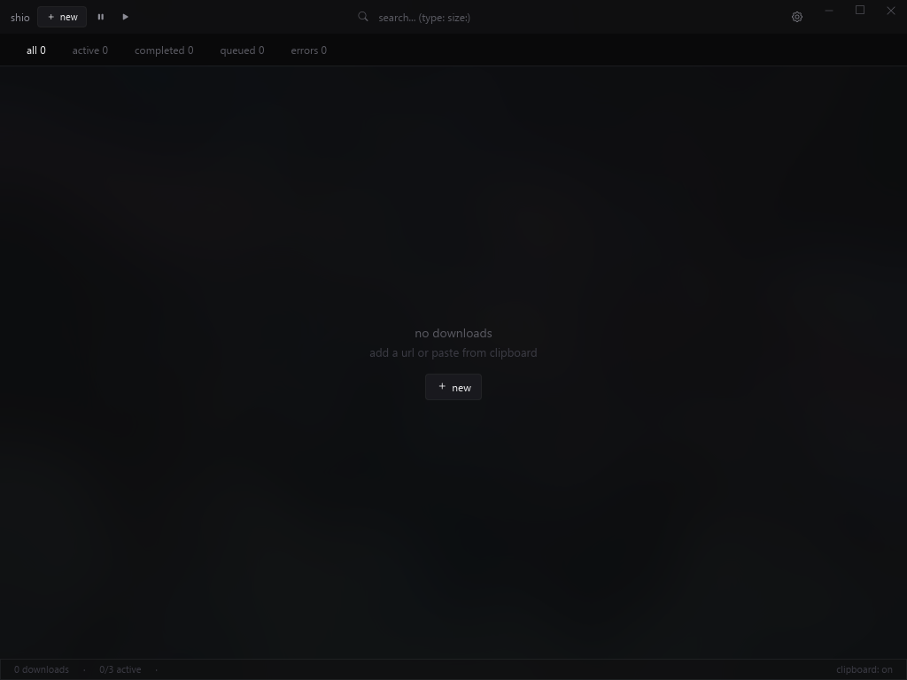
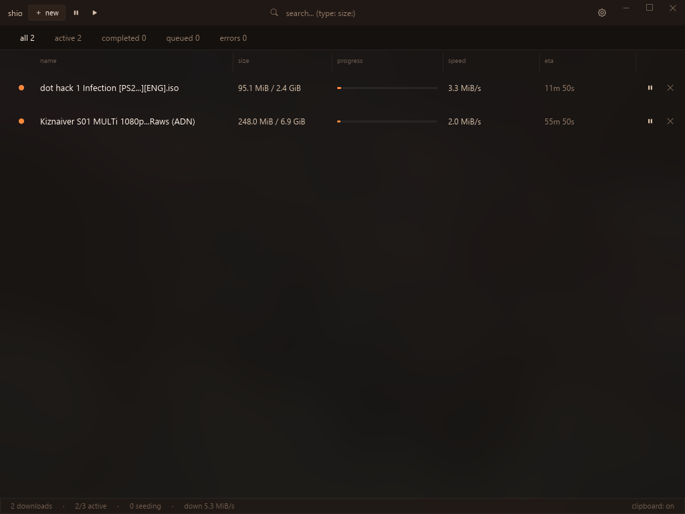

<div align="center">
  
  <h1>shio</h1>

  <p><strong>download manager</strong></p>
</div>

---

## features

- works with direct links and torrents
- gpu rendered ui
- segmented downloads with global controls and speed limits
- automatic archive extraction
- custom themes

## install

download the latest build from [releases](https://github.com/offs/shio/releases).
beta builds are unsigned. release artifacts include sha256 files and GitHub provenance attestations.

## screenshots

<p align="center">
  
  
</p>

## build

```sh
cargo build --release -p shio-app
```

the release binary is written to `target/release/`.

## checks

```sh
cargo fmt --all -- --check
cargo check --workspace --all-targets
cargo clippy --workspace --all-targets -- -D warnings
cargo test --workspace --all-targets
cargo deny check
```

## license

[MIT](LICENSE)
